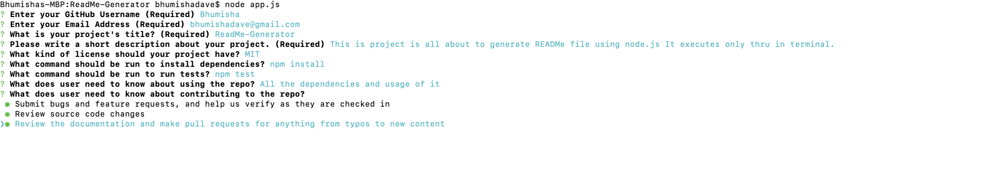
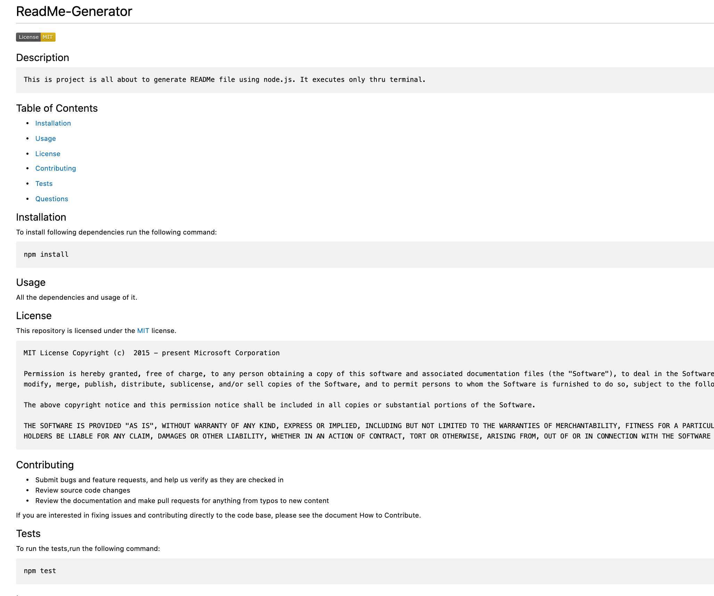

  # ReadMe-Generator 
  
  
  
  ## Description
    This is project is all about to generate READMe file using node.js. It run only thru terminal. To developed this project, I have used file and inquirer node modules. User has to provide Github details and also Project related informations. This project is deployed in Github. User can go thru files and clone the project.
  
  ## Table of Contents
  * [Installation](#installation)

  * [Usage](#usage)

  * [License](#license)

  * [Contributing](#contributing)

  * [Tests](#tests)

  * [Questions](#questions)

  ## Installation
  To install following dependencies run the following command:

    npm install

  ## Usage
  usre should know about its all dependencies and its usage.
  
  ## License 
  
This repository is licensed under the [Apache 2.0](https://opensource.org/licenses/Apache-2.0) license.

    Apache 2.0 License Copyright (c)  2015 - present Apache 2.0 Corporation

    Permission is hereby granted, free of charge, to any person obtaining a copy of this software and associated documentation files (the "Software"), to deal in the Software without restriction, including without limitation the rights to use, copy, modify, merge, publish, distribute, sublicense, and/or sell copies of the Software, and to permit persons to whom the Software is furnished to do so, subject to the following conditions:

    The above copyright notice and this permission notice shall be included in all copies or substantial portions of the Software.

    THE SOFTWARE IS PROVIDED "AS IS", WITHOUT WARRANTY OF ANY KIND, EXPRESS OR IMPLIED, INCLUDING BUT NOT LIMITED TO THE WARRANTIES OF MERCHANTABILITY, FITNESS FOR A PARTICULAR PURPOSE AND NONINFRINGEMENT. IN NO EVENT SHALL THE AUTHORS OR COPYRIGHT HOLDERS BE LIABLE FOR ANY CLAIM, DAMAGES OR OTHER LIABILITY, WHETHER IN AN ACTION OF CONTRACT, TORT OR OTHERWISE, ARISING FROM, OUT OF OR IN CONNECTION WITH THE SOFTWARE OR THE USE OR OTHER DEALINGS IN THE SOFTWARE.
    
  
  ## Contributing
  * Submit bugs and feature requests, and help us verify as they are checked in
* Review source code changes
* Review the documentation and make pull requests for anything from typos to new content

If you are interested in fixing issues and contributing directly to the code base, please see the document How to Contribute.
  
  ## Tests
  To run the tests,run the following command:
    
    npm test
  
  ## Images 
  The following screen demonstrates the application functionality

  Terminal Execution
  

  SampleReadME.md
  

  ## Questions
  
  If you have any additional questions about the repo, open an issue or contact me directly at bhumishadave@gmail.com.
  You can fine more of my work at [bhumisha](https://github.com/bhumisha)
 

